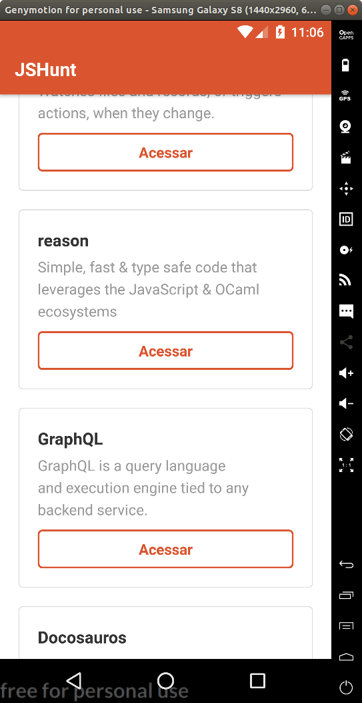

# JSHunt

Projeto para acompanhamento de curso sobre React Native, da [Rocketseat](https://rocketset.com.br).



## Execução de ambiente Android em Linux

1. Preparar ambiente conforme instruções em: https://docs.rocketseat.dev/ambiente-react-native/introducao

2. Preparar projeto com:

    ```
    yarn install
    ```

3. Executar emulador:

    ```
    genymotion
    ```

4. Executar aplicação em simulador

    ```
    react-native run-android
    ```

